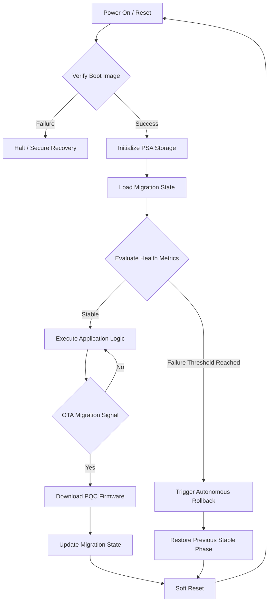

# System Architecture and Security Model

The QuantumShield architecture is designed to provide high-assurance cryptographic agility for embedded systems. It utilizes a layered approach to isolate sensitive cryptographic operations and migration logic.

## System Flow Diagram

The following diagram illustrates the autonomous migration and self-healing lifecycle managed by QuantumShield.

## Security Domains

### 1. Secure Processing Environment (SPE)
Running within ARM TrustZone (TF-M), the SPE handles:
*   **PQC Key Material:** Private keys for ML-KEM and ML-DSA never leave the SPE.
*   **State Persistence:** The migration state (Legacy, Hybrid, PQC) is stored in PSA Protected Storage, preventing tampering from the Non-Secure environment.
*   **Verification:** Secure boot and OTA signature verification are anchored in the SPE.

### 2. Non-Secure Processing Environment (NSPE)
The application-level middleware (QuantumShield NS-API) handles:
*   **Migration Orchestration:** Triggering updates and monitoring network health.
*   **Cryptographic Wrappers:** Providing a unified API to the application while delegating heavy lifting to the SPE or hardware accelerators.
*   **Resource Monitoring:** Profiling RAM and CPU usage to ensure PQC operations stay within safe bounds.

## Migration State Machine

QuantumShield implements a deterministic state machine to ensure consistency across the fleet:

| State | Classical Crypto | PQC Crypto | Self-Healing Active |
| :--- | :--- | :--- | :--- |
| **STATE_LEGACY** | Enabled | Disabled | No |
| **STATE_HYBRID** | Enabled | Enabled | Yes (Primary) |
| **STATE_PQC** | Disabled | Enabled | Yes (Secondary) |

The transition from `STATE_HYBRID` to `STATE_PQC` is only permitted after a sustained period of "System Health" verification, ensuring the target hardware can handle the PQC computational load without affecting real-time RTOS deadlines.
